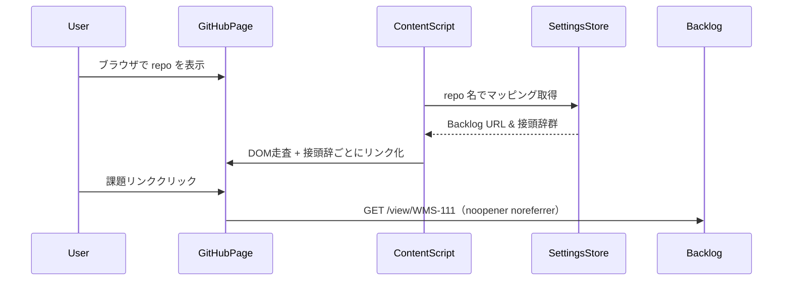

# Backlog課題キー自動リンク化 Chrome 拡張機能 要件定義書

## 1. 背景・目的
GitHub 上に現れる Backlog 課題キー（例: `WMS-111`, `TMS-222` など）を自動ハイパーリンク化し、クリックで Backlog 課題画面へ遷移できるようにして開発効率を向上させる。
リポジトリごとに複数の Backlog インスタンス／キー接頭辞を扱うプロジェクト向けに「リポジトリ ↔ Backlog URL ↔ キー接頭辞」の組み合わせをユーザ設定できるよう機能を拡張する。

## 2. スコープ

| 区分 | 適用範囲 |
|------|----------|
| 対象ページ | GitHub（`github.com/<org>/<repo>`）
| 検出キー | ユーザが設定した**接頭辞ごとのパターン**（例: `WMS-\\d+`, `TMS-\\d+` など） |
| 設定対象 | 複数リポジトリ × 複数 Backlog URL × 複数キー接頭辞の **多対多** 対応 |

## 3. 機能要件（★は追加要件）

| 番号 | 機能 | 説明 |
|------|------|------|
| F1 | 自動リンク化 | セキュアなテキストノード検出、XSS保護、`noopener noreferrer`設定 |
| F2 | 動的要素対応 | 効率的なMutationObserver（debounce処理、最小限監視）、GitHub SPA対応 |
| ★F3 | 設定 UI（拡張） | ① 一覧画面で「リポジトリ / Backlog URL / キー接頭辞」を表形式で表示・並べ替え<br>② 新規追加・編集・削除モーダルを提供<br>③ JSON インポート／エクスポートボタン |
| ★F4 | リポジトリ判定（新規） | ブラウザが表示している GitHub URL から `<org>/<repo>` を動的取得し、対応する設定行を選択してリンク化ロジックに適用 |
| F6 | 一時停止 | アイコンポップアップでページ単位・ドメイン単位で無効化／有効化 |
| ★F7 | エラーハンドリング | リンク化失敗時の適切なフォールバック、処理状況インジケーター |
| ★F8 | 監視・分析 | リンク化成功率追跡、パフォーマンスメトリクス収集、エラーログ構造化 |

## 4. 非機能要件

| 区分 | 要件 |
|------|------|
| 性能 | **段階的処理**：小規模PR（<100行）100ms以内、中規模PR（100-1000行）500ms以内、大規模PR（>1000行）Intersection Observer使用 |
| セキュリティ | `"activeTab"`, `"storage"` のみ許可、XSS保護、CSP対応、`noopener noreferrer`設定 |
| 保守性 | TypeScript + Vite, ESLint, Prettier, Unit Test (Vitest) カバレッジ 80 % 以上,  @crxjs/vite-plugin、E2Eテスト（Playwright） |
| UI/UX | ダーク／ライト両モードでコントラスト比 4.5:1 以上。設定画面は shadcn/ui ベースのレスポンシブデザイン、アクセシビリティ対応 |

## 5. 制約事項

1. **Manifest V3 必須**（Service Worker、長期実行不可）
2. **最小権限の原則**（初期は `https://github.com/*` のみ、Enterprise動的対応）
3. **DOM 安全性**（入力欄や既存リンクなどは除外、textContent使用）
4. **ストレージ階層化**：
   - chrome.storage.sync: ユーザー設定（10項目以内）
   - chrome.storage.local: リポジトリマッピング（1000項目対応）
   - chrome.storage.session: キャッシュデータ（一時的）
5. **プロキシ環境対応**（fetch 設定引継ぎ）
6. **パフォーマンス**（requestIdleCallback、debounce処理、Intersection Observer）
7. **GitHub.com / Enterprise にて動作テスト済**

## 6. 設定 UI 仕様

| 画面 | 要素 | 挙動 |
|------|------|------|
| 設定一覧 | DataTable (repo/url/key) | 行クリック → 編集モーダル、列ヘッダクリックでソート |
| 追加/編集モーダル | 入力: リポジトリ名, URL, キー接頭辞 | 保存時に形式チェックあり |
| インポート/エクスポート | JSON テキストエリア | JSON フォーマットで一括編集可 |

## 7. 想定利用シーケンス



## 8. 実装アーキテクチャ

### 8.1 パフォーマンス最適化パターン

```typescript
// 効率的なMutationObserver設定
const observer = new MutationObserver(debounce((mutations) => {
  const relevantMutations = mutations.filter(
    mutation => mutation.type === 'childList' && 
    mutation.addedNodes.length > 0
  );
  processNewNodes(relevantMutations);
}, 100));

observer.observe(document.body, {
  childList: true,
  subtree: true,
  attributeFilter: ['class'] // 必要最小限の監視
});
```

### 8.2 セキュアリンク生成パターン

```typescript
function createSecureLink(issueKey: string, backlogUrl: string): HTMLAnchorElement {
  const link = document.createElement('a');
  link.textContent = issueKey; // innerHTML回避
  link.href = `${sanitizeUrl(backlogUrl)}/view/${encodeURIComponent(issueKey)}`;
  link.target = '_blank';
  link.rel = 'noopener noreferrer'; // セキュリティ強化
  return link;
}
```

### 8.3 ストレージ階層化設計

```typescript
interface StorageDesign {
  sync: {
    userPreferences: UserPreferences; // 10項目以内
    globalSettings: GlobalSettings;
  };
  local: {
    repositoryMappings: RepositoryMapping[]; // 1000項目対応
    performanceMetrics: PerformanceMetrics;
  };
  session: {
    processingCache: ProcessingCache; // 一時的
    errorLogs: ErrorLog[];
  };
}
```

### 8.4 エラーハンドリング戦略

```typescript
class LinkProcessor {
  async processWithFallback(element: Element): Promise<void> {
    try {
      await this.processElement(element);
      this.recordSuccess();
    } catch (error) {
      this.recordError(error);
      this.showUserFeedback('リンク化処理中にエラーが発生しました');
    }
  }
}
```

## 9. テスト戦略

### 9.1 パフォーマンステスト

```typescript
// Performance APIを使った実測値測定
const startTime = performance.now();
processLinkification();
const endTime = performance.now();
console.log(`リンク化処理時間: ${endTime - startTime}ms`);
```

### 9.2 E2Eテスト設計

```typescript
// Playwrightでの自動テスト
test('GitHub PRでのリンク化テスト', async ({ page }) => {
  await page.goto('https://github.com/test/repo/pull/1');
  await page.waitForSelector('.backlog-issue-link');
  const linkCount = await page.locator('.backlog-issue-link').count();
  expect(linkCount).toBeGreaterThan(0);
});
```

## 10. 拡張性考慮

### 10.1 プラグインアーキテクチャ

```typescript
interface IssueTracker {
  name: string;
  detectPattern: RegExp;
  generateUrl: (key: string, baseUrl: string) => string;
}

class BacklogTracker implements IssueTracker {
  name = 'Backlog';
  detectPattern = /\b[A-Z]+-\d+\b/g;
  generateUrl = (key: string, baseUrl: string) => `${baseUrl}/view/${key}`;
}

// 将来的なJira、Linear等への対応を容易に
